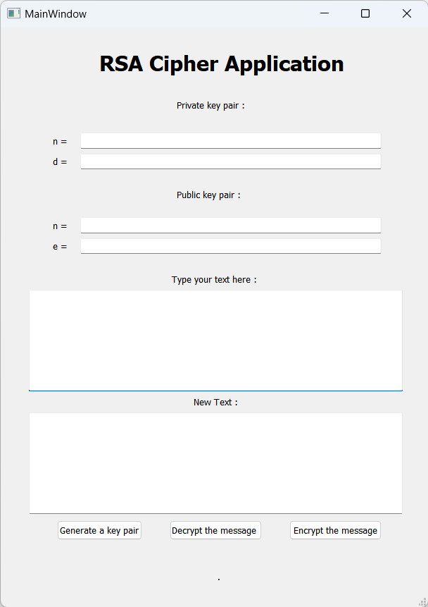

# RSA-Cipher
A RSA cipher application to encrypt and decrypt text using python.

## Create the exe 
run this command in powershell at the location of the project:
```powershell
pyinstaller --clean --windowed --onedir --add-data='.\RSA.ui;.' .\RSA.py
```
The executable file is now created in the dist/RSA folder.
## The application 

